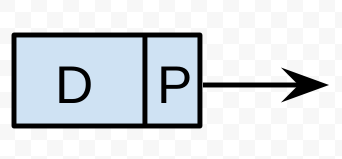

# Algorith-MX Group - Session 4

## Topic: Linked Lists

### Overview 

A _list_ is a simple structure that works as a sequence of objects/data where they are arranged in a "linear" order, this means that every object is after another.

Even when this sounds as an array there's an important difference: the access in an array is marked by a index to every element and in a _List_  the access is determined by a _pointer_ in each element. This pointer is a representation of where we are on the _List_  and which data is accesible for us. 

### Pointers

A pointer is a representation of where you're in a _list_. You can imagine this as the marker on a mall map saying to you where you're inside of the mall or even to the marker on the subway to telling you which station you're. With the pointers you can have control over how you move on the list but this can also be dangerous if you aren't careful because you can lose a position or even you can lose access to the list.

### The HEAD and the TAIL

In a _List_ it is commonly often to talk about the `HEAD` pointer, this pointer is a representation of where the _list_  starts, once you have access to the `HEAD` you can _iterate_ over the next elements.

When we talk about the `TAIL` we talk about the last element on the list, after this element there's no other element it's common that insertions to the _list_ are made by the `TAIL` but this is not mandatory.

### Nodes

The elements in the list are commonly called _nodes_, a node is a representation of a data element in the list plus his pointer. 

Next is an image that represents a single node

If you want a code representation this coul be easly made by:

### LinkedLists

_Lists_ as a concept exist in a lot of types, the most common type is the **LinkedList** which is a kind of _list_ where every